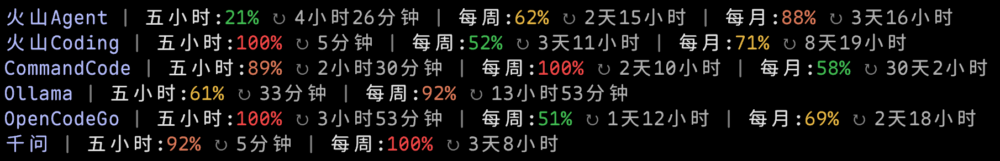

# CodingPlan Usage Query

<div align="center">


</div>

<p>

<div align="center">
    <a href="../README.md">中文</a> | English
    &emsp;----&emsp;
    <a href="https://gitee.com/minimote/coding-plan-usage-query">Gitee</a> | <a href="https://github.com/minimote/coding-plan-usage-query">GitHub</a>
</div>

<p>

> Query Coding Plan usage and reset countdown across platforms. Recommended for use with [ccstatusline](https://github.com/sirmalloc/ccstatusline) / [ccstatusline-zh](https://github.com/huangguang1999/ccstatusline-zh) custom commands, displayed in the Claude Code status bar.

## Supported Plans

|                  Plan                   |        How to get data        |
| :-------------------------------------: | :---------------------------: |
| Volcengine Ark Coding Plan / Agent Plan |  Volcengine OpenAPI (AK/SK)   |
|              Command Code               |         Internal API          |
|              Ollama Cloud               |  HTML page parsing (cookie)   |
|               OpenCode Go               |         Internal API          |
|      Alibaba Cloud Qwen Token Plan      | Console internal API (cookie) |

## Preview



> Run `scripts/preview.cmd` (or `node src/tools/preview.mjs`) to preview the display using mock data.

## Project Structure

```text
coding-plan-usage-query/
├── config/
│   ├── config.example.json                # Config template
│   └── config.schema.json                 # JSON Schema validation
├── docs/
│   ├── CHANGELOG.md                       # Changelog
│   ├── README_EN.md                       # English README
│   └── preview.png                        # Preview image
├── scripts/
│   ├── login-qwen.cmd                     # Double-click to log in to Qwen on Windows
│   ├── preview.cmd                        # Double-click to preview display on Windows
│   └── query-usage-all.cmd                # Double-click to run on Windows (UTF-8 via chcp 65001)
├── src/
│   ├── login/
│   │   └── login-qwen.mjs                 # Qwen login
│   ├── query/
│   │   ├── query-usage-all.mjs            # Query all plans (parallel)
│   │   ├── query-usage-ark.mjs            # Volcengine Ark query
│   │   ├── query-usage-commandcode.mjs    # Command Code query
│   │   ├── query-usage-ollama.mjs         # Ollama Cloud query
│   │   ├── query-usage-opencode-go.mjs    # OpenCode Go query
│   │   ├── query-usage-qwen.mjs           # Qwen Token Plan query
│   │   └── query-usage-smart.mjs          # Smart query: auto-match by current plan (with cache)
│   ├── tools/
│   │   ├── colorful-tokens.mjs            # Colorize context tokens by threshold
│   │   ├── get-actual-model-name.mjs      # Get actual model name
│   │   ├── get-actual-provider-name.mjs   # Get actual provider name
│   │   └── preview.mjs                    # Generate mock usage preview output
│   └── utils/
│       ├── utils-cc-switch.mjs            # CC-Switch utilities
│       ├── utils-login.mjs                # Shared login logic (Playwright, profile, config writeback)
│       └── utils-query-usage.mjs          # Shared utilities
├── test/                                  # Unit tests (node --test)
└── tmp/                                   # Query result cache and login profiles (auto-generated, gitignored)
```

Each query script follows a "exported function + CLI shell" dual-entry pattern: it can be run directly with `node`, and is also called in-process by `smart`/`all` to avoid child-process startup overhead.

## Prerequisites

- Node.js 22.13 or later (uses built-in `node:sqlite` module; experimental warning is suppressed automatically)

## Quick Start

### 1. Create config file

Copy `config/config.example.json` to `config/config.json`.

### 2. Fill in credentials

Open `config.json` and fill in credentials according to `config.schema.json`:

- **Volcengine Ark Coding Plan / Agent Plan**: Create an AccessKey in the Volcengine console, fill in `accessKeyId` and `secretAccessKey`
- **Command Code**: Get an API Key from the Command Code website, fill in `apiKey`
- **Ollama Cloud**: Fill in `cookie` according to `config.schema.json`
- **OpenCode Go**: Subscribe to Go in the OpenCode Console, create an API Key, and fill it into `apiKey`
- **Alibaba Cloud Qwen Token Plan**: Run `login-qwen.cmd` to auto-fill the `cookie`, or fill in manually according to `config.schema.json`

See [Configuration](#configuration) below for details.

### 3. Run queries

```bash
# Smart query: auto-match by current plan (with cache)
node src/query/query-usage-smart.mjs

# Query all plans
node src/query/query-usage-all.mjs

# Volcengine Ark (uses account's `type`, defaults to coding)
node src/query/query-usage-ark.mjs

# Volcengine Ark Agent Plan (override)
node src/query/query-usage-ark.mjs --type agent

# Command Code
node src/query/query-usage-commandcode.mjs

# Ollama Cloud
node src/query/query-usage-ollama.mjs

# OpenCode Go
node src/query/query-usage-opencode-go.mjs

# Alibaba Cloud Qwen
node src/query/query-usage-qwen.mjs

# Log in to Qwen via browser, auto-read credentials
node src/login/login-qwen.mjs

# Specify account position (0-indexed)
node src/query/query-usage-ark.mjs --position 1

# Preview display
node src/tools/preview.mjs
```

> The above commands can also be run via npm scripts: `npm run query` (smart), `npm run query:all`, `npm run query:ark`/`query:commandcode`/`query:ollama`/`query:opencode`/`query:qwen` (per-plan), `npm run login:qwen` (login). To pass arguments, add `--`, e.g. `npm run query:ark -- --type agent`.

## Command Line Arguments

Query scripts support the following arguments:

|           Argument            | Short | Description                                                                                                                                |
| :---------------------------: | :---: | ------------------------------------------------------------------------------------------------------------------------------------------ |
|          `--display`          | `-d`  | Display mode: `auto` (default, `a`) / `long` (`l`) / `short` (`s`)                                                                         |
|           `--type`            | `-t`  | Volcengine Ark plan type: `coding` (`c`) / `agent` (`a`); falls back to the account's `type`, then `coding` (ignored by all/smart scripts) |
|         `--position`          | `-p`  | Account position (0-indexed, default 0)                                                                                                    |
| `--hide-on-monthly-exhausted` |   -   | Hide this query's output when monthly quota is exhausted (`true`/`false`, default `false`; ignored by the smart script)                    |
|  `--hide-on-no-active-plan`   |   -   | Hide this query's output when there is no active plan (`true`/`false`, default `false`; only effective for the `all` script)               |

> Login scripts (`login-qwen`) only support the `--position`/`-p` argument. `position` ranges 0~N (N = current account count): `< N` updates an existing account, `= N` creates a new one; out-of-range prompts re-entry, and opening the browser asks for confirmation.

## Configuration

`config/config.json` is a JSON object with five keys: `ark` (Volcengine Ark accounts), `commandcode` (Command Code accounts), `ollama` (Ollama Cloud accounts), `opencode` (OpenCode Go accounts), and `qwen` (Alibaba Cloud Qwen accounts). Each key holds an array of account objects. Multiple accounts are supported.

### Volcengine Ark Coding Plan / Agent Plan

```json
{
    "ark": [
        {
            "shortLabel": "Coding",
            "longLabel": "火山Coding",
            "apiKey": "xxx",
            "type": "coding",
            "accessKeyId": "xxx",
            "secretAccessKey": "xxx"
        },
        {
            "shortLabel": "Agent",
            "longLabel": "火山Agent",
            "apiKey": "xxx",
            "type": "agent",
            "accessKeyId": "xxx",
            "secretAccessKey": "xxx"
        }
    ]
}
```

|           Field            | Required | Description                                                             |
| :------------------------: | :------: | ----------------------------------------------------------------------- |
|           `type`           |    No    | Plan type: `coding` (default) or `agent`                                |
| `longLabel` / `shortLabel` |    No    | Display label, defaults to `火山Coding`/`Coding` or `火山Agent`/`Agent` |
|       `accessKeyId`        |   Yes    | Volcengine AccessKey ID                                                 |
|     `secretAccessKey`      |   Yes    | Volcengine SecretAccessKey                                              |
|          `apiKey`          |    No    | CC-Switch API Key for matching current account                          |

Create an AccessKey at <https://console.volcengine.com/iam/keymanage> (sub-accounts need `AccessKeySelfManageAccess` and `ArkReadOnlyAccess` permissions).

### Command Code

```json
{
    "commandcode": [
        {
            "apiKey": "xxx",
            "shortLabel": "CommandCode",
            "longLabel": "CommandCode"
        }
    ]
}
```

|           Field            | Required | Description                                                            |
| :------------------------: | :------: | ---------------------------------------------------------------------- |
| `longLabel` / `shortLabel` |    No    | Display label, defaults to `CommandCode`                               |
|          `apiKey`          |   Yes    | Command Code API Key, used for usage queries and smart-script matching |

### Ollama Cloud

```json
{
    "ollama": [
        {
            "apiKey": "xxx",
            "shortLabel": "Ollama",
            "longLabel": "Ollama",
            "cookie": "xxx"
        }
    ]
}
```

|           Field            | Required | Description                                                          |
| :------------------------: | :------: | :------------------------------------------------------------------- |
| `longLabel` / `shortLabel` |    No    | Display label, defaults to `Ollama`/`Ollama`                         |
|          `cookie`          |   Yes    | Value of the `__Secure-session` cookie, copied from browser DevTools |
|          `apiKey`          |    No    | CC-Switch API Key for matching current account                       |

> Ollama login is protected by Cloudflare bot detection. Playwright-launched browsers are flagged as automated and cannot pass verification, so no login script is provided. After logging in at <https://ollama.com>, copy the value of `__Secure-session` from browser DevTools -> Application -> Cookies into the config.

### OpenCode Go

```json
{
    "opencode": [
        {
            "apiKey": "xxx",
            "shortLabel": "Go",
            "longLabel": "OpenCode Go"
        }
    ]
}
```

|           Field            | Required | Description                                     |
| :------------------------: | :------: | :---------------------------------------------- |
| `longLabel` / `shortLabel` |    No    | Display label, defaults to `OpenCode Go`/`Go`   |
|          `apiKey`          |   Yes    | OpenCode Go API Key, same value as in CC-Switch |

### Alibaba Cloud Qwen Token Plan

```json
{
    "qwen": [
        {
            "shortLabel": "千问",
            "longLabel": "千问",
            "apiKey": "xxx",
            "cookie": "xxx"
        }
    ]
}
```

|           Field            | Required | Description                                                        |
| :------------------------: | :------: | ------------------------------------------------------------------ |
| `longLabel` / `shortLabel` |    No    | Display label, defaults to `千问`/`千问`                           |
|          `cookie`          |   Yes    | Qwen console login cookie, auto-filled by running `login-qwen.cmd` |
|          `apiKey`          |    No    | CC-Switch API Key for matching current account                     |

## Auto-Match Account

`query-usage-smart.mjs` workflow:

1. Prioritize the `CC_SWITCH_PROVIDER_ID` env var injected by [CC Launcher](#related-projects) to look up the actual provider in the database; fall back to `currentProviderClaude` from `~/.cc-switch/settings.json` when the id is missing, not found, or the database read fails
2. Get the current provider's API Key (prioritize env vars `ANTHROPIC_AUTH_TOKEN`/`ANTHROPIC_API_KEY`; fall back to `~/.cc-switch/cc-switch.db` in proxy mode)
3. Match the account with the same `apiKey` in `config.json`
4. Call the corresponding query function in-process

Notes:

- When a free model is detected or no matching account is found, all accounts are displayed instead
- Query results are cached for 5 seconds, and error results for 30 seconds (`tmp/cache-usage.json`), to reduce API calls under frequent refreshes
- Running the sub-scripts manually does not use the cache

## Usage with ccstatusline / ccstatusline-zh

It is recommended to configure `query-usage-smart.mjs` as a custom command in ccstatusline / ccstatusline-zh for real-time display in the Claude Code status bar (use absolute path):

```bash
node F:/xxx/query-usage-smart.mjs
```

- Recommended: set the custom command timeout greater than the script's internal timeout (10 seconds), otherwise the status bar will show a display error
- To display colored percentages, check "preserve colors" for the custom command in ccstatusline / ccstatusline-zh

## [Changelog](CHANGELOG.md)

## Related Projects

- **CC Launcher** ([Gitee](https://gitee.com/minimote/cc-launcher) | [GitHub](https://github.com/minimote/cc-launcher)): Launch Claude Code with a specified CC-Switch provider; multiple instances using different providers can run simultaneously without affecting the global active state.

## [MIT License](../LICENSE)
